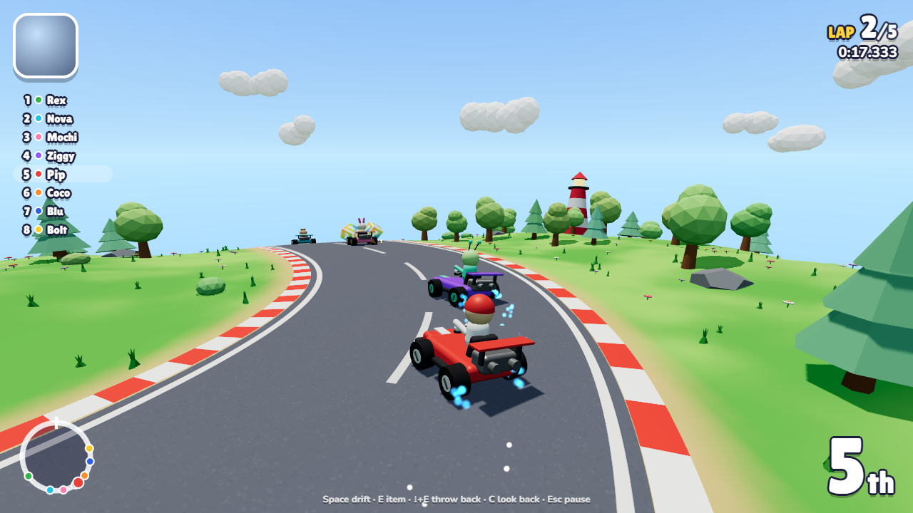
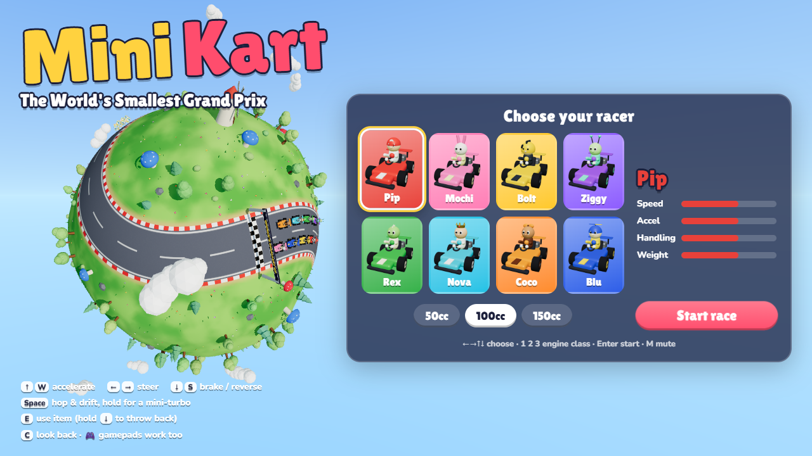

# Mini Kart — The World's Smallest Grand Prix

A kart racer set on a planet so small you can see the whole world from the start line.
Eight racers, five laps, drifting with mini-turbos, item boxes, shells, bananas, boost
pads and a rocket start. The course is a tennis-ball seam wrapped around the planet,
so each lap you race over both poles.

**▶ Play it: https://mattias800.github.io/minikart/**




## Controls

| Action | Keyboard | Gamepad |
| --- | --- | --- |
| Accelerate | `↑` / `W` | A / RT |
| Brake / reverse | `↓` / `S` | B / LT |
| Steer | `←` `→` / `A` `D` | Left stick / D-pad |
| Hop & drift (hold) | `Space` / `Shift` | RB |
| Use item | `E` / `X` / `Ctrl` | LB / X |
| Throw item backwards | hold `↓` while using | hold stick back |
| Look back | `C` | Y |
| Pause | `Esc` / `P` | Start |
| Mute | `M` | |

**Tips**

- **Drift:** hold the drift button and steer into a corner. Sparks turn blue → orange → purple
  the longer you hold the drift; release it for a mini-turbo.
- **Rocket start:** press accelerate just after the **2** of the countdown. Press too early and the engine floods.
- **Shortcuts:** grass slows you down, unless you're boosting or have a star.
- Green shells travel in a straight line, and on a planet this small that means they can
  come all the way round and hit you from behind.

## Items

| Item | Effect |
| --- | --- |
| 🍄 Turbo Shroom | A short burst of speed |
| 🍄🍄🍄 Triple Shrooms | Three of them |
| 🍌 Banana | Drop it behind you; anyone who drives over it spins out |
| 🟢 Green Shell | Fires straight ahead, bounces off trees |
| 🔴 Red Shell | Follows the road, then homes in on the racer ahead of you |
| ⭐ Super Star | Invincibility and extra speed; ram other karts to spin them out |

Just like the classics, the further back you are, the better your items.

## Running locally

```bash
npm install
npm run dev       # http://localhost:5173
npm test          # unit tests + a headless 8-AI race
npm run build     # production build in dist/
```

Add `?autopilot` to the URL to let the AI drive your kart (handy for demos and testing).

## How it's built

TypeScript + [three.js](https://threejs.org/), bundled with Vite. There are no asset files:
models are built from primitives, textures are painted on canvases, and all audio (engine,
sound effects and the chiptune soundtrack) is synthesised with the Web Audio API.

```
src/
  config.ts        Tuning knobs (planet size, laps, engine classes)
  core/math.ts     Sphere maths (moving along great circles), RNG, noise
  sim/             The game simulation: pure logic, no rendering, runs in Node
    Track.ts         Arc-length sampled road on a sphere; locate/progress queries
    TrackLayout.ts   The course shape (a wobbly tennis-ball seam)
    World.ts         Procedural placement of trees, landmarks, item boxes, boost pads
    Kart.ts          Kart physics: throttle, grip, hop, drift and mini-turbos
    AIDriver.ts      Pure-pursuit AI: racing lines, drifting, item use, recovery
    Race.ts          Rules: countdown, laps, ranking, items, collisions, rubber-banding
    events.ts        Everything the sim reports (audio/UI/effects listen to these)
  render/          three.js views of the simulation (planet, karts, items, particles, camera,
                   and the WorldBend shader that flattens the view while racing)
  audio/           Web Audio synth, music sequencer and sound effects
  ui/              HUD, menus and overlays (plain DOM)
  input/           Keyboard and gamepad
  game/Game.ts     The main loop and screen flow
```

**Seeing the road on a tiny planet.** A planet this small curves away so fast that a normal
chase camera only sees a few metres of track. So while racing, a vertex shader
(`render/WorldBend.ts`) "unrolls" the planet around you: every point is remapped onto a sphere
7× larger that touches the real one under your kart, keeping distances along the ground intact.
The simulation still happens on the tiny planet (lap times, shells circling the world, the view
from the menu); only the picture is flatter. The intro fly-in blends from the real planet to the
unrolled view. Tweak `RACING_BEND` in `game/Game.ts` to change how flat it looks.

The simulation runs at a fixed 120 Hz and knows nothing about rendering. Karts live on the
surface of a sphere: every step they are moved along a great circle and their direction
vectors are parallel-transported with them. Because the sim is pure logic, the tests run
complete races headlessly (`src/sim/Race.test.ts`), checking that AI karts finish, drift,
use items and stay on the road.

Ideas for later: more planets (a new course is just another `TrackCurve`), split-screen
multiplayer (the sim is renderer-agnostic, so it's mostly a second camera and input mapping),
time trials with ghosts, touch controls.
